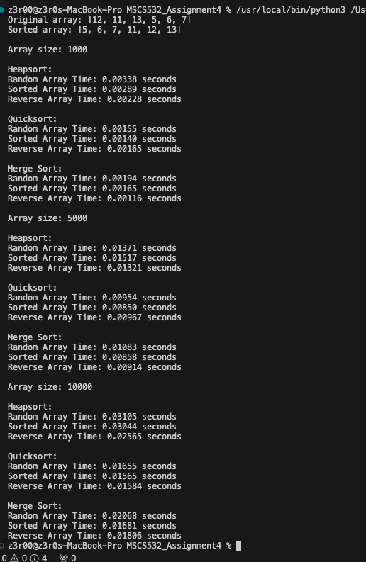
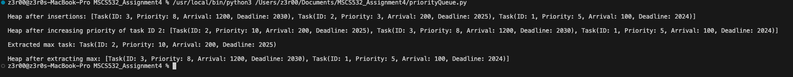

1. Heapsort Implementation and Analysis:

File Name: heapsort.py
Output: To get the output of the code, simply run the code in VSC.
Below is the screenshot of the output

This output includes array getting sorted using Heapsort.
Also, comparison between heapsort, mergesort and quicksort in different array size.
Please review doc.md for more information on the comparison.

2. Priority Queue Implementation and Applications

File Name: priorityQueue.py
Output: To get the output of the code, simply run the code in VSC.
Below is the screenshot of the output

This output contains a heapsort data after inserting 3 tasks.
Output after the priority of one of the task has been increased.
Output of the extracted max priority task.
Output after extraction of max priority task.

